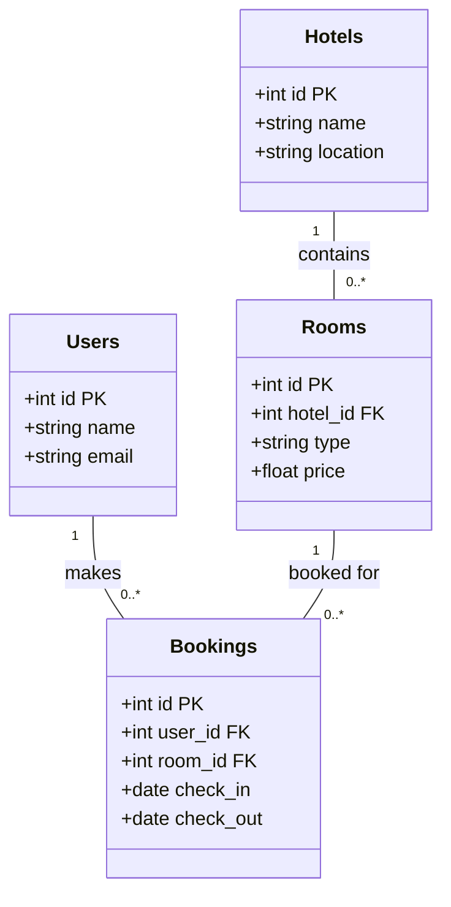

```mermaid
classDiagram
    class Users {
        +int id PK
        +string name
        +string email
    }
    class Hotels {
        +int id PK
        +string name
        +string location
    }
    class Rooms {
        +int id PK
        +int hotel_id FK
        +string type
        +float price
    }
    class Bookings {
        +int id PK
        +int user_id FK
        +int room_id FK
        +date check_in
        +date check_out
    }
    Users "1" -- "0..*" Bookings : makes
    Hotels "1" -- "0..*" Rooms : contains
    Rooms "1" -- "0..*" Bookings : booked for
```
