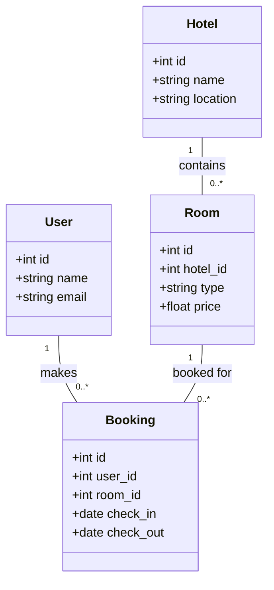

```mermaid
classDiagram
    class User {
        +int id
        +string name
        +string email
    }
    class Hotel {
        +int id
        +string name
        +string location
    }
    class Room {
        +int id
        +int hotel_id
        +string type
        +float price
    }
    class Booking {
        +int id
        +int user_id
        +int room_id
        +date check_in
        +date check_out
    }
    User "1" -- "0..*" Booking : makes
    Hotel "1" -- "0..*" Room : contains
    Room "1" -- "0..*" Booking : booked for
```
