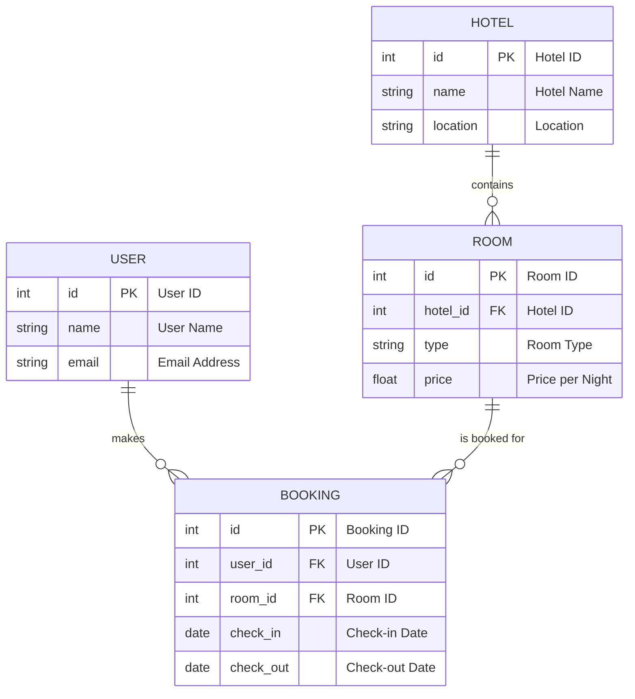

```mermaid
erDiagram
    USER ||--o{ BOOKING : makes
    HOTEL ||--o{ ROOM : contains
    ROOM ||--o{ BOOKING : "is booked for"
    USER {
        int id PK "User ID"
        string name "User Name"
        string email "Email Address"
    }
    HOTEL {
        int id PK "Hotel ID"
        string name "Hotel Name"
        string location "Location"
    }
    ROOM {
        int id PK "Room ID"
        int hotel_id FK "Hotel ID"
        string type "Room Type"
        float price "Price per Night"
    }
    BOOKING {
        int id PK "Booking ID"
        int user_id FK "User ID"
        int room_id FK "Room ID"
        date check_in "Check-in Date"
        date check_out "Check-out Date"
    }
```
