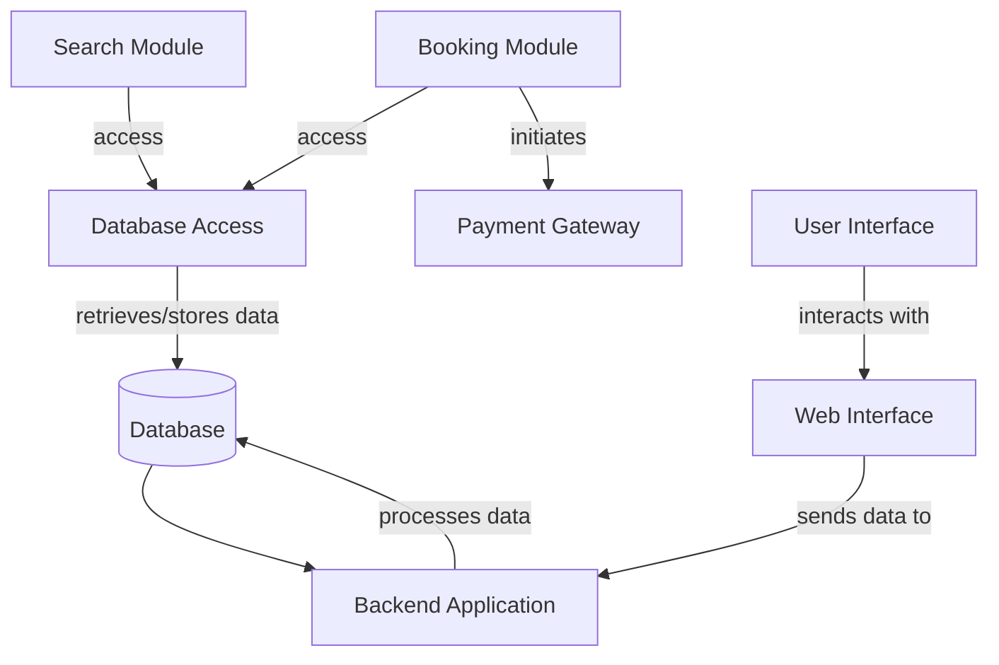

```mermaid
graph TD
    SM[Search Module] -->|access| DA[Database Access]
    BM[Booking Module] -->|access| DA
    DA -->|retrieves/stores data| DB[(Database)]
    BM -->|initiates| PG[Payment Gateway]

    UI[User Interface] -->|interacts with| WI[Web Interface]
    WI -->|sends data to| BA[Backend Application]
    BA -->|processes data| DB[(Database)]
    DB --> BA
```
